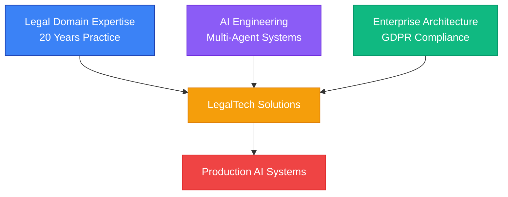
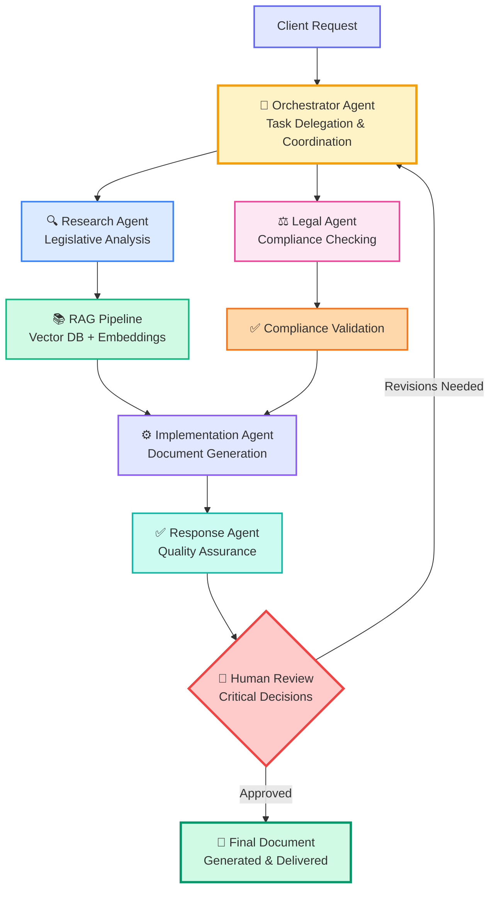
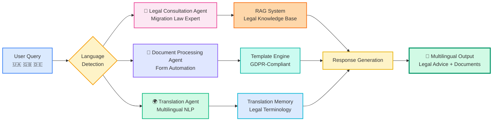
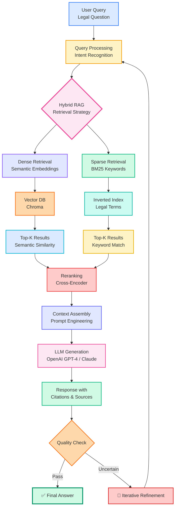
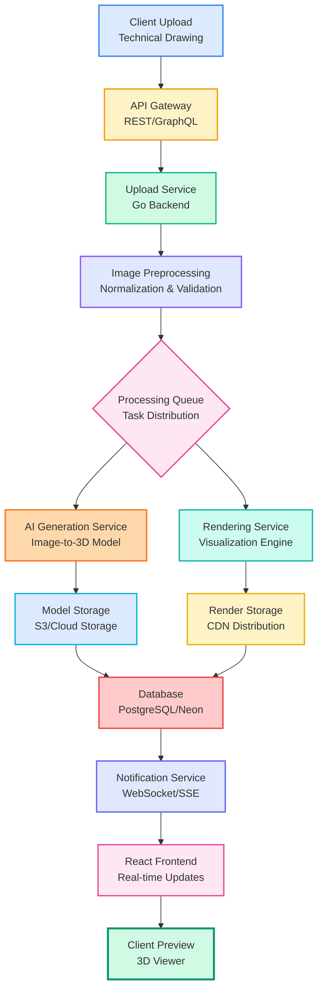
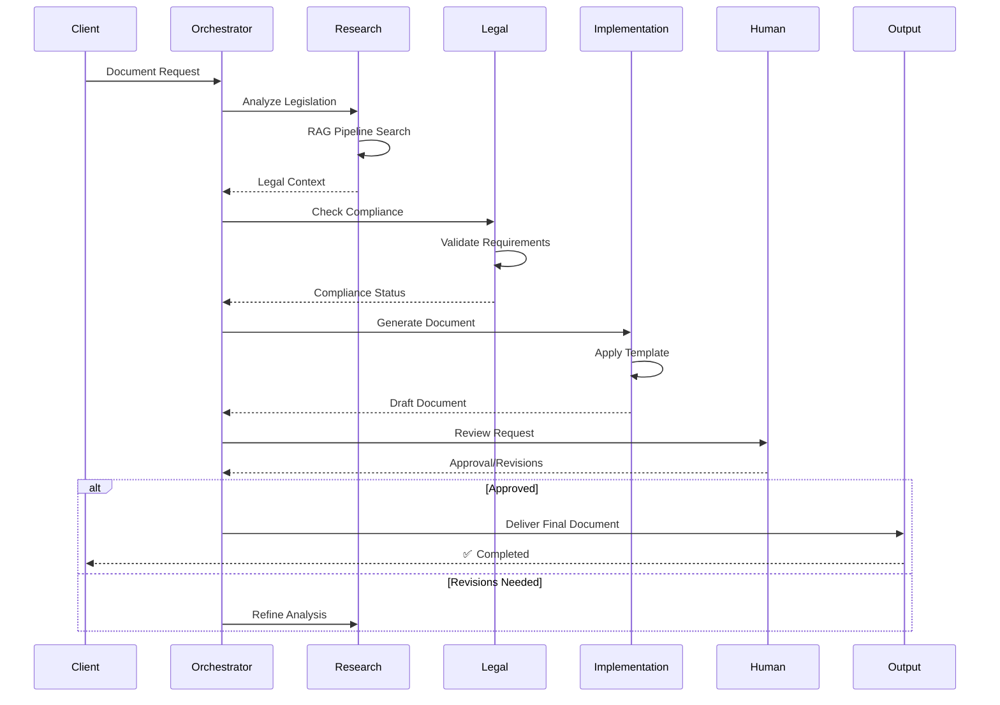

<div align="center">

# ⚖️ Serhii Rozum | Legal AI Engineer & Architect 🤖

[](https://linkedin.com/in/serhiirozum)
[](mailto:serhiirozum@icloud.com)
[]()

### 🏛️ 20 Years Legal Practice × 💡 4+ Years AI Engineering × 🔬 LegalTech Innovation

</div>

---

## 👨‍💼 About Me

**Legal AI Engineer & Solutions Architect** bridging **20 years of active legal practice** (prosecutor, attorney) with **hands-on AI engineering expertise**. I architect and build **production-ready AI systems** specifically for the legal industry.

- ⚖️ **LegalTech Solutions**: Document automation, legal research, compliance monitoring
- 🤖 **Multi-Agent AI Systems**: CrewAI orchestration, RAG pipelines, autonomous agents
- 🏢 **Enterprise AI**: GDPR-compliant systems, privacy-by-design architecture
- 🌍 **Domain Expertise**: Tax Law, IT Law, GDPR/DSGVO, International Legal Frameworks

**Licensed Attorney** in Ukraine (2018-present) | Based in **Munich, Germany** 🇩🇪

---

## 🚀 What I Do

### 🎯 AI Solutions Architecture
I design and implement **production-grade AI systems** that transform legal operations:

- **60% time reduction** in document processing (1,500+ documents/month)
- **93% litigation success rate** through AI-powered case analysis
- **GDPR-compliant** AI architectures for EU markets

### 🛠️ Core Specializations



**Legal Practice** → Tax Law • IT Law • GDPR Compliance • International Law  
**AI Engineering** → Multi-Agent Systems • RAG Pipelines • LLM Orchestration  
**Enterprise Solutions** → SaaS Platforms • API Design • Microservices Architecture

---

## 💼 Featured AI Projects

### 🏢 Enterprise Document Automation System

**Multi-agent AI system with 5 specialized agents** for automated legal document generation, review, and approval workflows.



**Key Features:**
- 🔍 **Research Agent** - Legislative and case law analysis
- ⚖️ **Legal Agent** - Legislation compliance checking
- 🎯 **Orchestrator Agent** - Workflow coordination and task delegation
- ⚙️ **Implementation Agent** - Document generation and formatting
- ✅ **Response Agent** - Quality assurance and final review
- 👤 **Human-in-the-Loop Module** - Critical decision points oversight

**Documents Automated:** Contracts • Invoices • Proposals • Offers  
**Impact:** 60% time reduction, 1,500+ documents monthly  
**Tech Stack:** `CrewAI` `LangChain` `LangGraph` `OpenAI GPT-4` `Claude` `Pinecone` `Qdrant`

---

### 🌍 Migration Support Multi-Agent System

**Multilingual AI system** for refugee and migration support with specialized agents coordinating legal advice, document processing, translation, and appointment scheduling.



**Agents:** 3 specialized agents for legal consultation, document automation, and multilingual support  
**Languages:** Ukrainian • German • English • Multilingual NLP  
**Privacy:** GDPR-compliant, privacy-by-design architecture for sensitive personal data  
**Tech Stack:** `CrewAI` `Anthropic Claude` `Multilingual NLP` `Privacy-by-Design`

---

### 🔎 AI Legal Research Assistant

**Hybrid RAG-based system** for Ukrainian and European legislation analysis with semantic search optimized for legal terminology.



**Unique Features:**
- 📚 **Custom Embeddings** - Fine-tuned for legal terminology and concepts
- ⚡ **Semantic Search** - Intelligent query understanding with Mem0 (Base25)
- 🎯 **Legal-Specific Prompts** - Specialized prompt engineering for legal reasoning
- 🔄 **Hybrid RAG Architecture** - Combined dense and sparse retrieval for precision

**Tech Stack:** `LangChain` `Chroma` `Mem0 (Base25)` `OpenAI` `Claude API` `Custom Embeddings`

---

### 🏗️ 3D Architectural Visualization AI Platform

**Full-stack microservices platform** for automated generation of architectural visualizations from technical drawings.



**Architecture:** Production-ready microservices with Docker deployment  
**Tech Stack:** `Go (Backend)` `React (Frontend)` `PostgreSQL` `Neon` `Docker` `REST/GraphQL API` `AI Image Generation`

---

## 🎥 See My Work in Action

<details>
<summary>📹 <strong>Enterprise Document Automation Workflow Demo</strong></summary>

### Workflow Demonstration:



**Key Metrics:**
- ⚡ Average processing time: **3-5 minutes** (vs 45-60 min manual)
- 📊 Accuracy rate: **98.5%** after human review
- 🔄 Revision rate: **<15%** requiring substantial changes

</details>

---

## 🛠️ Technology Stack

### **AI Engineering & LLM Orchestration**


### **LLM APIs**


### **Development & Languages**


### **AI Development Tools**


### **Databases & Vector Stores**


-6366F1?style=flat-square)

### **Infrastructure & DevOps**


### **No-Code/Low-Code Platforms**


---

## 📊 GitHub Stats

<div align="center">


</div>

---

## 🔭 Currently Exploring

- 🧪 **LangGraph Cloud** - Scalable multi-agent deployment and orchestration
- 🔐 **Homomorphic Encryption** - Privacy-preserving AI for sensitive legal data
- 📊 **Graph RAG** - Advanced knowledge graph integration for case law analysis
- 🌐 **Agentic Workflow Orchestration** - Next-generation CrewAI patterns and architectures
- 🧠 **Fine-tuning Legal LLMs** - Domain-specific model optimization for legal reasoning

---

## 🎓 Expertise & Credentials

### 🏛️ Legal Practice (20 Years)
- **Licensed Attorney** in Ukraine (2018-present)
- **Former State Prosecutor** (2005-2017) - 97% success rate in tax litigation
- **Managing Partner** at Law Firm ERESEM (2018-2022)

### 🎯 Legal Specializations
**Tax Law** • **IT Law** • **GDPR/DSGVO Compliance** • **International Legal Frameworks** • **Administrative Law** • **Contract Law**

### 🎓 Education
- **Master of Law (LL.M.)** - International Law & European Relations  
  *Ukrainian Free University Munich, Germany* (2022-present)
  
- **Master of Law (LL.M.)** - Jurisprudence  
  *Yaroslav Mudryi National Law University, Kharkiv, Ukraine* (2006)

### 📜 Certifications
- ✅ AI Agents Development & Integration (FWDays, May 2025)
- ✅ Tax Law 7.0: Ukraine & International (Business Consulting Academy, 2023)
- ✅ Digital Law X.0: IT Business Legal Support - GDPR, IP, Structuring (2022)
- ✅ IT-Law Program (Institute of Law, Technology & Innovation, 2017)
- ✅ Introduction to ECHR and ECtHR (Council of Europe HELP Programme, 2022)

### 🌍 Languages
**🇺🇦 Ukrainian/Russian:** Native  
**🇬🇧 English:** Professional (B2)  
**🇩🇪 German:** Intermediate (B1/B2, actively improving)

---

## 🏆 Key Achievements

- 🎯 **60% reduction** in document processing time through AI automation
- ⚖️ **93% litigation success rate** using AI-powered case analysis
- 📄 **1,500+ documents** processed monthly by multi-agent systems
- 🌍 **GDPR-compliant** AI architecture for EU legal market
- 💼 **20 years** of active legal practice + **4+ years** AI engineering

---

## 💡 Innovation Focus

```
┌─────────────────────────────────────────────────────────────┐
│                                                             │
│  LegalTech Innovation = Legal Expertise × AI Engineering   │
│                                                             │
│  🏛️ Legal Domain Knowledge (20 years)                      │
│       ↓                                                     │
│  🤖 AI/ML Engineering (Multi-Agent, RAG, LLM)              │
│       ↓                                                     │
│  🔬 Production-Ready LegalTech Solutions                   │
│       ↓                                                     │
│  ⚡ Enterprise Deployment (GDPR-compliant, Scalable)       │
│                                                             │
└─────────────────────────────────────────────────────────────┘
```

### 🔬 Current Research & Development
- 🧠 **Advanced RAG architectures** for legal document analysis
- 🤝 **Multi-agent collaboration patterns** for complex legal workflows
- 🔒 **Privacy-preserving AI** for sensitive legal data processing
- 📊 **Predictive legal analytics** using LLMs and custom embeddings

---

## 🎯 Ideal Collaboration Opportunities

| Type | What I'm Looking For |
|------|---------------------|
| 💼 **Consulting** | Legal departments seeking AI transformation (document automation, compliance monitoring) |
| 🤝 **Partnerships** | LegalTech startups needing AI architecture expertise |
| 🚀 **Full-Time Roles** | Senior AI Engineer / Legal AI Architect positions in LegalTech/Enterprise |
| 🔬 **Research Projects** | GDPR-compliant AI, multi-agent systems, legal NLP |

---

## 🤝 Let's Connect!

I'm open to:

- 💼 **Consulting**: AI strategy for legal operations and LegalTech implementation
- 🤝 **Collaboration**: AI/LegalTech community projects and innovation initiatives
- 🚀 **Opportunities**: Full-time roles, project-based work, or partnerships in LegalTech/AI space

### 📬 Get in Touch

[](https://linkedin.com/in/serhiirozum)
[](mailto:serhiirozum@icloud.com)
[](tel:+4917012039460)

---

<div align="center">

### ⚖️ Bridging Law and Technology with AI Innovation 🤖

*"Transforming legal practice through intelligent automation and AI-powered solutions"*

**Available for consulting, collaboration, and opportunities** • **Based in Munich, Germany** 🇩🇪

---


</div>