

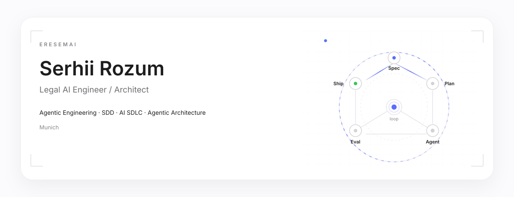

**Legal AI Engineer / Architect**  
Agentic Engineering · Spec-Driven Development · AI SDLC · Agentic Architecture

[LinkedIn](https://www.linkedin.com/in/serhiirozum) · Open to research, consulting & engineering collaboration

---

## TL;DR for hiring managers

1. **Role:** Legal AI Engineer / Architect — agentic systems, SDD/AI SDLC, production delivery  
2. **Proof:** [Legal AI notes](https://github.com/eresemai/legal-ai-agentic-architecture) · [Case one-pager](https://github.com/eresemai/legal-ai-agentic-architecture/blob/main/docs/case-one-pager.md) · [Eval harness](https://github.com/eresemai/legal-eval-harness) · [RE 3D notes](https://github.com/eresemai/re-3d-interactive-architecture) · Evidence below  
3. **Next step:** message on [LinkedIn](https://www.linkedin.com/in/serhiirozum) with **problem + constraints** (advisory / build / research)

---

## Who I hire for / not for

**Strong fit**
- AI Solutions / Legal AI roles inside law firms & legal departments  
- AI Architect / Agentic systems lead (enterprise transformation)  
- Forward-deployed AI engineer embedding agents into real workflows  
- Platform / product-eng hybrid for interactive 3D experiences in real estate  

**Usually not a fit**
- Ticket-factory “LLM wrapper” junior roles  
- Pure academic research without shipping ownership  
- Narrow vendor-tool consulting with no architecture ownership  
- Unrelated hardware / automotive robotics IC tracks  

---

## How I decide (operating principles)

1. **Spec before agents** — contracts and SDD before autonomous loops  
2. **HITL on irreversible actions** — humans remain final authority where law/business risk is real  
3. **Eval before scale** — measure legal/task quality before widening blast radius  
4. **Publish ≠ admin power** — buyer/embed surfaces never inherit privileged controls  
5. **Domain law as constraint** — legal requirements shape architecture, not slideware  

## About

I design and ship production systems where **law, agents, and product engineering** meet — Legal AI architectures, multi-agent document workflows, evaluation harnesses, and interactive 3D platforms for real estate developers.

**21 years in law** (governance & private practice) as the domain layer. Founder / operator since 2017. Day-to-day: **Agentic Engineering**, **SDD / OpenSpec**, **AI SDLC**, and **Agentic Architecture** — specs first, constrained agent loops, humans on the critical path when judgment matters.

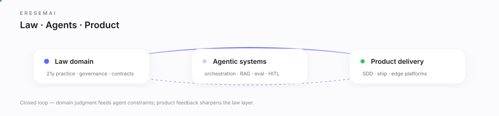

---

## How I build

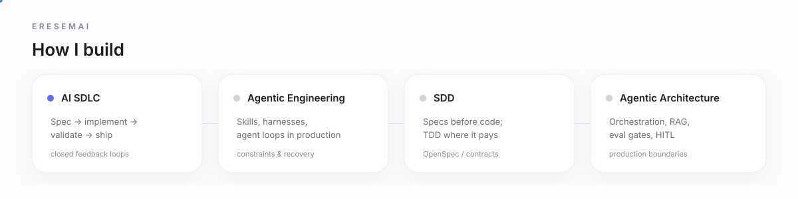

- **AI SDLC** — Spec → implement → validate → ship, with closed feedback loops instead of one-shot generation.
- **Agentic Engineering** — Skills, harnesses, and agent loops as production software: constraints, recovery, measurable outcomes.
- **Spec-Driven Development (SDD)** — OpenSpec-style contracts before code; TDD where it pays.
- **Agentic Architecture** — Orchestration, RAG, eval gates, and human-in-the-loop boundaries designed up front.

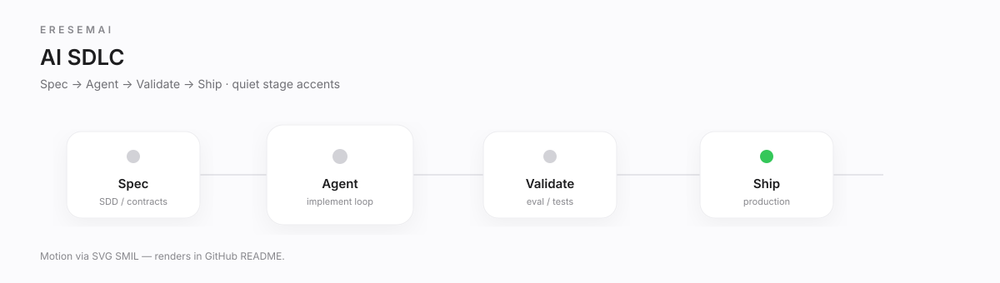
  
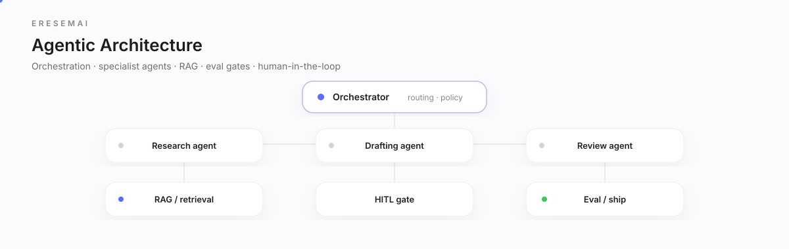

---

## Tech stack

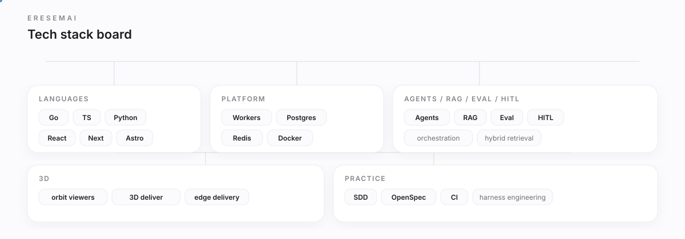

**Languages & UI**  
`Go` `TypeScript` `Python` `React` `Next.js` `Astro`

**Platform & data**  
`Edge workers` `PostgreSQL` `Redis` `Docker` `REST / GraphQL`

**Agents, RAG & evaluation**  
`Agent orchestration` `RAG` `Hybrid retrieval` `Eval harnesses` `HITL gates` `LangGraph / LangChain` `CrewAI` (where it fits)

**3D & spatial product**  
`Browser 3D interactives` `Publish / edge delivery` `Admin tooling` `Embeddable experiences`

**Delivery practice**  
`OpenSpec / SDD` `TDD` `CI` `Skills & harness engineering` `Claude Code` `Codex` `Cursor`

**LLMs (production use)**  
`Claude` `GPT` `Gemini` — selected per task latency, cost, and eval score

---

## Selected work

### 3D interactives, visualization & marketing for real estate developers

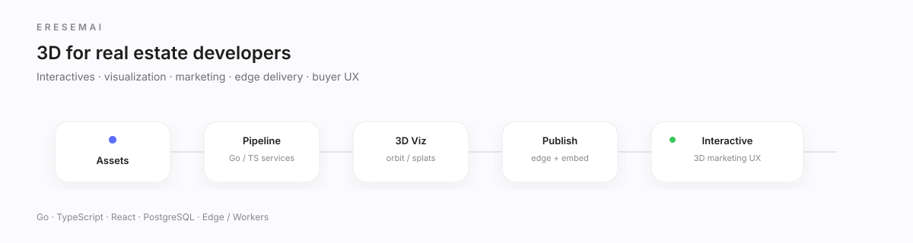

Not a static “presentation deck” — **product platforms** for developers:

- **3D interactives** — orbit viewers, master plans, facade mapping, unit inventory UX
- **3D visualization pipelines** — ingest → process → render → edge delivery
- **3D marketing surfaces** — buyer-facing experiences, admin publish flows, embed / white-label delivery
- **In-browser** project exploration with manager publish tooling

`Go` `TypeScript` `React` `Next.js` / `Astro` `PostgreSQL` `Edge delivery`

---

### Multi-agent document systems (HITL)

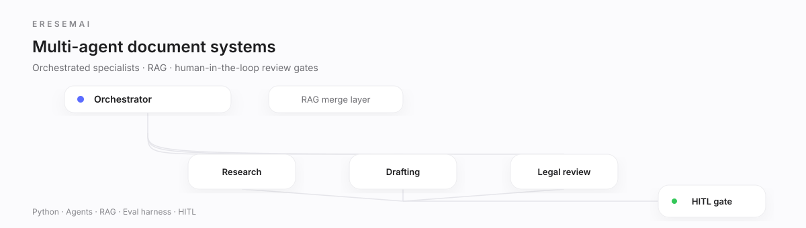

Orchestrated multi-agent systems for document research, drafting, and review in legal / studio ops — RAG merge layers and **explicit human-in-the-loop** gates before delivery (contracts, invoices, proposals, offers).

`Python` `Agents` `RAG` `Eval harness` `HITL` `FastAPI`

---

### Legal research & evaluation

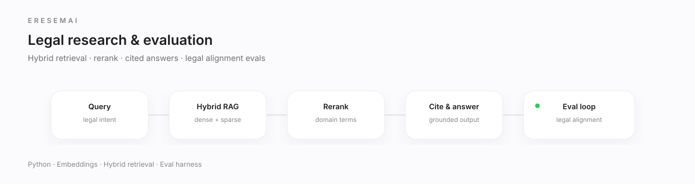

Hybrid retrieval over legislation and case material, reranking for legal terminology, cited answers, and **legal-alignment evaluation** loops (where systems follow — or fail — the law).

`Python` `Embeddings` `Hybrid retrieval (dense + BM25)` `Rerank` `Eval harness`

---

### More shipped systems

| Area | What it does | Stack (essence) |
|------|----------------|-----------------|
| **Invoice & voice automation** | Voice/text → structured invoices & docs with review gates | Python · Whisper · Agents · Telegram |
| **Corporate knowledge agents** | CLI / RAG over internal corpora for ops & legal support | Python · RAG · embeddings |
| **AI sales / marketing automation** | Agent workflows for docs, mockups, and delivery pipelines | TypeScript · Python · CI |
| **Migration / multilingual support agents** | UA · DE · EN routing across legal consult, docs, translation | Agents · multilingual NLP · privacy-by-design |
| **Public SDD greenfield** | Bilingual invoice app as agentic / OpenSpec practice | [Invoice Maker (Fwdays 2026)](https://github.com/eresemai/2026-fwdays-agentic-greenfield-task-INVOICE-MAKER-2026) · Next.js · TypeScript · SDD |
| **Eval harness (public)** | Synthetic legal-ish cases + deterministic graders | [legal-eval-harness](https://github.com/eresemai/legal-eval-harness) · Python · pytest |
| **Agent skills (fork)** | Upstream skills pack used in daily agentic practice | [skills](https://github.com/eresemai/skills) · fork of [coleam00/skills](https://github.com/coleam00/skills) |

---

---

## Evidence (anonymized)

Outcomes from production systems (no clients named):

| Signal | Result |
|--------|--------|
| Document cycle time | **45–60 min → 3–5 min** per case after agent draft + human review gate |
| Throughput | **1,500+** documents / month through assisted pipelines |
| Review quality | **≥98%** post-review acceptance on gated outputs (human remains final authority) |

How to verify on a tech screen: architecture walkthroughs in the public notes below — failure modes, HITL boundaries, and eval loops included.

**Runnable proof**
- [legal-eval-harness](https://github.com/eresemai/legal-eval-harness) — synthetic cases + deterministic graders (`pytest` / CLI)

**Architecture notes (public, sanitized)**  
- [Legal AI · Agentic systems](https://github.com/eresemai/legal-ai-agentic-architecture) · [Case one-pager](https://github.com/eresemai/legal-ai-agentic-architecture/blob/main/docs/case-one-pager.md)  
- [Real-estate 3D interactives](https://github.com/eresemai/re-3d-interactive-architecture) · [Case one-pager](https://github.com/eresemai/re-3d-interactive-architecture/blob/main/docs/case-one-pager.md)

## Credentials & qualifications

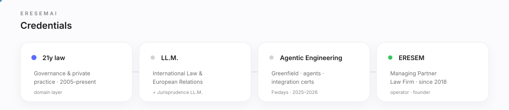

- **21 years in law** — state governance & law-enforcement administration (2005–2017); Attorney in Ukraine & private practice (2018–present)
- **Managing Partner**, Law Firm **ERESEM** (2018–present)
- **Specializations:** Tax Law · IT Law · GDPR / DSGVO · International frameworks · Administrative Law · Contract Law

**Education**
- LL.M. International Law & European Relations — Ukrainian Free University Munich (2022–present)
- LL.M. Jurisprudence — Yaroslav Mudryi National Law University, Kharkiv (2006)

**Certifications**
- Crash Course: Agentic Engineering for Greenfield Projects (Fwdays, mentored by Vyacheslav Koldovskyi, June 2026)
- Agentic Engineering (Kyrylo Sulimovskyi, 2026)
- AI Agents Development & Integration (FWDays, 2025)
- Tax Law 7.0: Ukraine & International (Business Consulting Academy, 2023)
- Digital Law X.0: IT Business Legal Support — GDPR, IP, Structuring (2022)
- IT-Law Program (Institute of Law, Technology & Innovation, 2017)
- Introduction to ECHR and ECtHR (Council of Europe HELP Programme, 2022)

**Languages**  
Ukrainian / Russian — Native · English — Professional (B2) · German — Intermediate (B1/B2)

---

## Let's collaborate

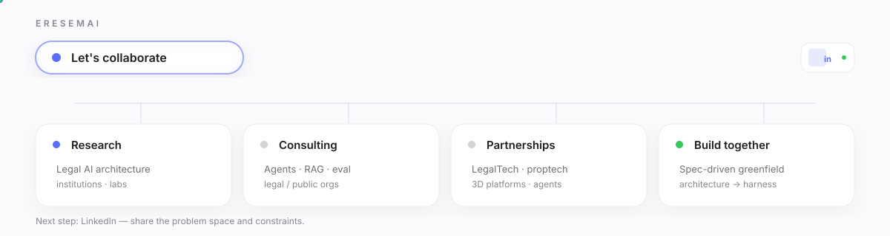

I'm looking for partners and roles where **Legal AI architecture**, **agentic delivery**, and **real-estate 3D product engineering** create leverage:

| | |
|--|--|
| **Research / architecture** | Legal AI Architect · Research Engineer roles at AI × law × institutions |
| **Consulting** | Legal departments & public institutions modernizing with agents, RAG, and eval |
| **Product partnerships** | LegalTech / civic-tech / proptech teams needing agentic systems or 3D interactive platforms |
| **Build together** | Spec-driven, agentic greenfield — from architecture to production harness |

**Next step:** message me on [LinkedIn](https://www.linkedin.com/in/serhiirozum) with the problem space and constraints — I’ll reply with a concrete collaboration shape (advisory, build, or research).

---

## Connect

[LinkedIn — Serhii Rozum](https://www.linkedin.com/in/serhiirozum)

**ERESEMAI** · Open to collaboration

