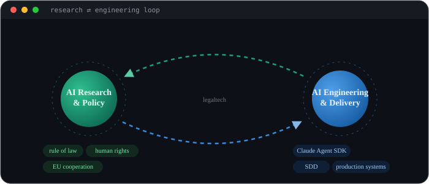
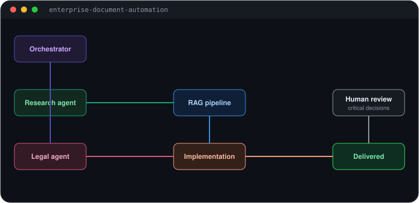
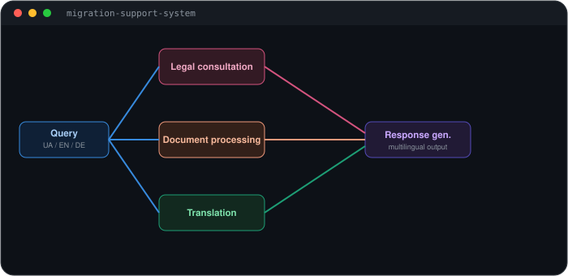
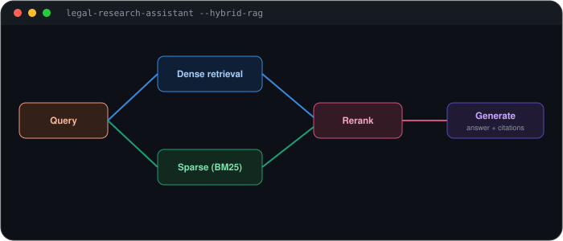
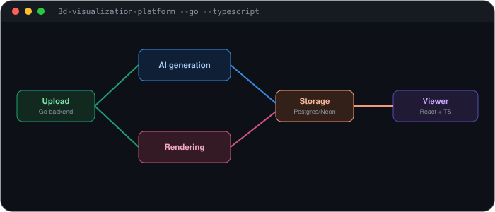

---

## About me

I work at the intersection of law, social research, and applied AI engineering — based in Munich, Germany.

Twenty-one years in law: first inside state governance and law-enforcement administration, then in private legal practice. The throughline across both has been the same — protecting human rights, and protecting the legal interests of business and the state, through the development of law. Alongside that, years of hands-on work in human-rights protection, migration and integration support, and cross-border research with EU partners shaped the questions I care about: how legal and democratic systems hold up under pressure, and where technology helps or hurts.

I'm currently reading for an LL.M. in International Law & European Relations at the Ukrainian Free University in Munich — the same questions, examined more formally.

Since 2017 I've also built and run businesses — founding and leading teams and product ventures. That's the engineering side of the same coin: research tells me what's broken, building things is how I test whether a fix actually works.

<table>
<tr>
<td width="50%" valign="top">

### 🔬 AI Research & Policy

- Sociotechnical research on AI, law, and democratic institutions — where AI systems should (and shouldn't) exercise legal judgment
- Human rights, migration and integration policy work, including cross-border research collaboration with EU institutions and programs
- Legal alignment questions: evaluating whether AI systems interpret and follow the law correctly, and where they fail
- LL.M. International Law & European Relations, Ukrainian Free University Munich (in progress)
- LL.M. Jurisprudence, Yaroslav Mudryi National Law University

</td>
<td width="50%" valign="top">

### ⚙️ AI Engineering & Delivery

- Design and ship production AI systems (agents, RAG, evaluation harnesses) that operationalize the research
- Spec-driven development (SDD), TDD, agent-loop and skills engineering as day-to-day practice
- Founder and lead on multiple business ventures and teams since 2017, spanning legal-tech products, AI-driven services, and early-stage startups
- 21 years of legal practice as the domain layer under the engineering
- AI research & engineering practice since 2025

</td>
</tr>
</table>

---

## Business & ventures (since 2017)

Founded, led, or advised on multiple ventures. Without naming each one, the throughlines:

- **Legal-tech products** — turning document-heavy legal workflows into software
- **Team leadership** — hiring and running small cross-functional legal + engineering + product teams
- **Early-stage startups** — several ventures at pre-seed/seed stage in legal services and AI-enabled products
- **Managing Partner, Law Firm ERESEM (2018–present)** — the one venture named directly

---

## 💼 Featured AI Projects

### 🏢 Enterprise Document Automation System

Multi-agent system (5 specialized agents) automating legal document generation, review, and approval — an orchestrator routes work to research and legal agents, results merge through a RAG pipeline into drafting, with a human review gate before delivery.

**Handles:** Contracts • Invoices • Proposals • Offers
**Built with (at the time):** `CrewAI` `LangChain` `LangGraph` `GPT-4` `Claude` `Pinecone` `Qdrant`

---

### 🌍 Migration Support Multi-Agent System

Multilingual system for refugee and migration support — detects the query language, then routes to legal consultation, document processing, and translation agents that converge into a single multilingual response.

**Languages:** Ukrainian • German • English
**Privacy:** GDPR-compliant, privacy-by-design architecture for sensitive personal data
**Built with (at the time):** `CrewAI` `Anthropic Claude` `Multilingual NLP`

---

### 🔎 AI Legal Research Assistant

Hybrid RAG system for Ukrainian and European legislation — combines dense (semantic) and sparse (BM25) retrieval, reranks results, and generates cited answers tuned for legal terminology.

**Built with (at the time):** `LangChain` `Chroma` `Custom embeddings` `Claude API`

---

### 🏗️ 3D Architectural Visualization AI Platform

Full-stack microservices platform turning technical drawings into 3D visualizations — a Go backend handles upload and preprocessing, parallel AI-generation and rendering services write to Postgres/Neon, and a React + TypeScript frontend streams results in real time, with golden-vector test parity between the Go and TypeScript layers.

**Built with:** `Go` `TypeScript` `React` `PostgreSQL` `Neon` `Docker` `REST/GraphQL API`

---

## 🛠️ AI Engineering Practice

**Methodology**
`Spec-Driven Development (SDD)` `OpenSpec` `TDD` `Agent-loop engineering` `Skills engineering`

**Agentic coding platforms**
`Claude Code CLI` `Codex CLI` `Cursor` `Devin`

**Skills & frameworks**
`Superpowers — obra/superpowers` `Matt Pocock — Skills for Real Engineers (mattpocock/skills)` `andrej-karpathy-skills — forrestchang/andrej-karpathy-skills`

**Terminal & voice workflow**
`Ghostty` `cmux (agent + worktree aware)` `Superwhisper (voice-to-text)`

**MCP & integrations**
`MCP (Model Context Protocol)` `Linear` `Computer-use automation` `HeyGen` `Remotion`

**Data & infra**
`PostgreSQL` `Neon` `Pinecone` `Chroma` `Qdrant` `Docker` `REST/GraphQL`

**Also used (lighter focus)**
`CrewAI` `LangChain` `LangGraph`

**LLM APIs**
`Claude Sonnet 5` `Claude Opus 4.8` `Claude Haiku 4.5` `GPT-5.6 (Sol/Terra/Luna)` `Gemini 3.5 (Pro/Flash)`

**Languages**
`Python` `Go` `TypeScript` `React / Next.js`

  

---

## 🎓 Legal & Academic Credentials

- **21 years in law** — state governance & law-enforcement administration (2005–2017), private legal practice as Attorney in Ukraine (2018–present)
- **Managing Partner**, Law Firm ERESEM (2018–present)

**Specializations:** Tax Law • IT Law • GDPR/DSGVO Compliance • International Legal Frameworks • Administrative Law • Contract Law

**Education**
- LL.M. International Law & European Relations — Ukrainian Free University Munich, Germany (2022–present)
- LL.M. Jurisprudence — Yaroslav Mudryi National Law University, Kharkiv, Ukraine (2006)

**Certifications**
- AI Agents Development & Integration (FWDays, 2025)
- Tax Law 7.0: Ukraine & International (Business Consulting Academy, 2023)
- Digital Law X.0: IT Business Legal Support — GDPR, IP, Structuring (2022)
- IT-Law Program (Institute of Law, Technology & Innovation, 2017)
- Introduction to ECHR and ECtHR (Council of Europe HELP Programme, 2022)

**Languages**
🇺🇦 Ukrainian/Russian — Native · 🇬🇧 English — Professional (B2) · 🇩🇪 German — Intermediate (B1/B2)

---

<b>📊 Impact snapshot</b>

 

| | |
|---|---|
| Document processing time | 45–60 min → 3–5 min per case |
| Monthly document volume | 1,500+ / month |
| Litigation matters, AI-assisted analysis | 90%+ favorable outcomes |
| Post-review document accuracy | 98%+ |

---

## 📊 GitHub Stats

---

## 🔭 Currently Exploring

- 🏛️ **Legal alignment evaluations** — testing whether AI systems interpret and follow the law correctly
- 🌐 **AI × democratic institutions** — sociotechnical research on civic participation and deliberation
- 🔐 **Privacy-preserving AI** for sensitive legal and social data
- 🧠 **Agent-loop & skills engineering** patterns across Claude Code, Codex, and Cursor
- 📊 **Evaluation design** for legal and policy reasoning tasks

---

## 🎯 Ideal Collaboration Opportunities

| Type | What I'm looking for |
|------|---------------------|
| 🔬 **Research roles** | Research Engineer / sociotechnical roles at the intersection of AI, law, and democratic institutions |
| 💼 **Consulting** | Legal departments and public institutions seeking AI transformation |
| 🤝 **Partnerships** | LegalTech and civic-tech startups needing AI research or engineering depth |
| 🚀 **Full-time roles** | AI Research Engineer / Legal AI Architect positions |

---

## 🤝 Let's connect

### Law, research, and AI engineering — one throughline

**Based in Munich, Germany** 🇩🇪 · **Open to research & engineering opportunities**

